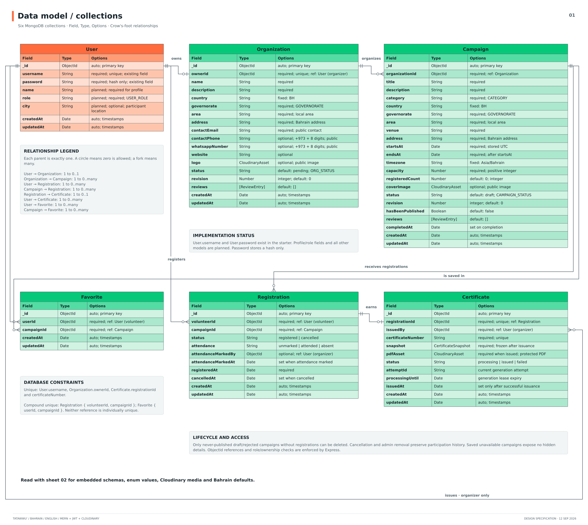

# Tatawwu’ — Volunteering in Bahrain

Tatawwu’ brings charitable, volunteer, and humanitarian campaigns in Bahrain into one place. Volunteers can discover activities, save favorites, share campaign links, and track participation. Organizers manage reviewed campaigns, publish updates, record attendance, and grant downloadable certificates.

**Repositories:** [Frontend — React](https://github.com/ctarek2015-wq/tatawuu-frontend) · [Backend — Express and MongoDB](https://github.com/EshaAbbasi/TatawwuBackend)

1. [AAU user stories](#1-aau-user-stories)
2. [Entity relationship diagrams](#2-entity-relationship-diagrams-erds)
3. [Application pages](#3-application-pages)
4. [Routes](#4-routes)
5. [Component hierarchy](#5-component-hierarchy)

### Getting started

- **Live website:** [Tatawwu](https://tatawuu-frontend.vercel.app/).
- **Live backend:** [API](https://tatawwubackend.onrender.com).

- **Deployment:** configure the environments below, then deploy the frontend and backend separately.
- **Planning:** [team Trello board](https://trello.com/b/SZ3tg7mp/tatawuu).
- **Frontend repository:** [ctarek2015-wq/tatawuu-frontend](https://github.com/ctarek2015-wq/tatawuu-frontend).
- **Backend repository:** [EshaAbbasi/TatawwuBackend](https://github.com/EshaAbbasi/TatawwuBackend).

## 1. AAU user stories

### Visitors

| ID  | User story                                                                                                                                       |
| --- | ------------------------------------------------------------------------------------------------------------------------------------------------ |
| U01 | As a visitor, I want to browse approved volunteering activities in Bahrain so that I can find opportunities to participate.                      |
| U02 | As a visitor, I want to filter campaigns by governorate, area, category, and date so that I can find suitable activities.                        |
| U03 | As a visitor, I want to view campaign images, Bahrain time, venue, and organization information so that I understand an activity before joining. |
| U04 | As a visitor, I want to create a volunteer or organizer account so that I can use the platform.                                                  |
| U05 | As a user, I want to sign in and sign out so that I can securely access my account.                                                              |
| U06 | As a user, I want to edit my name and optional city so that my profile stays accurate.                                                           |
| U07 | As a visitor, I want to copy a public campaign’s link so that I can share the opportunity with others.                                           |
| U08 | As a visitor, I want to open an organization’s public email, phone, or WhatsApp contact link so that I can ask about a campaign.                 |

### Volunteers

| ID  | User story                                                                                                                  |
| --- | --------------------------------------------------------------------------------------------------------------------------- |
| V01 | As a volunteer, I want to register for an available campaign so that I can immediately reserve a place.                     |
| V02 | As a volunteer, I want to cancel before the activity starts so that another person can use my place.                        |
| V03 | As a volunteer, I want to view upcoming and past registrations so that I can track my participation.                        |
| V04 | As a volunteer, I want to see my attendance status so that I know whether my participation was recorded.                    |
| V05 | As a volunteer, I want to preview and download my certificates so that I have a record of my contribution.                  |
| V06 | As a volunteer, I want to save, view, and remove favorite campaigns so that I can return to opportunities that interest me. |

### Organizers

| ID  | User story                                                                                                                                    |
| --- | --------------------------------------------------------------------------------------------------------------------------------------------- |
| O01 | As an organizer, I want to create and edit my Bahrain organization profile so that I can submit it for approval.                              |
| O02 | As an organizer, I want to upload, replace, or remove my organization’s logo so that volunteers can recognize it.                             |
| O03 | As an organizer, I want to create and view campaign drafts so that I can prepare activities in Bahrain.                                       |
| O04 | As an organizer, I want to edit campaign information and its cover image before the activity starts so that the listing stays accurate.       |
| O05 | As an organizer, I want to delete unused unpublished campaigns so that I can remove unnecessary drafts.                                       |
| O06 | As an organizer, I want to submit campaigns for approval and read rejection feedback so that I can get them published.                        |
| O07 | As an organizer, I want to cancel a published campaign so that participants can see that it will not take place.                              |
| O08 | As an organizer, I want to view participants and record attendance after an activity so that participation is documented.                     |
| O09 | As an organizer, I want to complete a campaign after recording attendance so that attendees become eligible for certificates.                 |
| O10 | As an organizer, I want to grant certificates to eligible attendees so that their user IDs are recorded in the campaign’s certificate grants. |

### Admins

| ID  | User story                                                                                                                       |
| --- | -------------------------------------------------------------------------------------------------------------------------------- |
| A01 | As an admin, I want to review organization information, location, and logo so that I can approve Bahrain-based organizations.    |
| A02 | As an admin, I want to review each campaign’s details, location, and image so that I can approve suitable activities in Bahrain. |
| A03 | As an admin, I want to reject or remove inappropriate content with feedback so that organizers understand my decision.           |

## 2. Entity relationship diagrams (ERDs)

[Embedded participation and locations](assets/ERD/02-erd-embedded-schemas.svg) · [Participation and update routes](assets/routes/06-participation-updates.svg)

The application uses **four MongoDB models: User, Organization, Campaign, and CampaignUpdate**. Participants are embedded in Campaign, following the embedded-comments approach in the Hoots example. Organization, Campaign, and CampaignUpdate are three entities in addition to User. There is no separate Registration model or API.

| Model        | Main fields and relationships                                                                                                                                                                                                             |
| ------------ | ----------------------------------------------------------------------------------------------------------------------------------------------------------------------------------------------------------------------------------------- |
| User         | `username`, hashed `password`, `name`, optional `city`, and `role` (`Volunteer`, `Organizer`, `Admin`).                                                                                                                                   |
| Organization | One `ownerId` referencing User; name, description, Bahrain location, public contacts, `logo`, `logoPublicId`, optional `latitude`/`longitude`, status, and review feedback.                                                               |
| Campaign     | `organizationId`, title, description, category, Bahrain location, venue, `startsAt`, `endsAt`, capacity, optional `latitude`/`longitude`, cover image/public ID, status, `wasPublished`, participants, favorites, and certificate grants. |

| CampaignUpdate | `campaignId` referencing Campaign, `authorId` referencing User, nonempty `text`, `createdAt`, and `updatedAt`. |

Usernames are unique within each role. The same username can have separate Admin, Organizer, and Volunteer accounts. Sign-in selects the matching username and role, then checks that account's password.

Each participant contains `volunteerId`, `status` (`Registered` or `Cancelled`), and `attendance` (`Unmarked`, `Attended`, or `Absent`). Cancellation keeps the history; rejoining uses the same participant entry. `registeredCount` and `availablePlaces` are calculated from active participants rather than saved counters.

Favorites and certificates contain User IDs. Certificates are granted only to attendees of completed campaigns. A PDF is generated when requested, using the current volunteer, campaign, organization, and activity date. There is no separate certificate model or stored PDF file.

Country is `BH`. Governorates are Capital, Northern, Southern, and Muharraq; Riffa belongs in the area field. Dates are stored in UTC, while inputs and displayed times use Bahrain time (`Asia/Bahrain`, UTC+3).

### Workflow

1. An organizer creates an organization, which enters Pending review. Saving changes sends it for review again.
2. Campaigns begin as Draft. An approved organization can submit a campaign for admin review.
3. Admins approve or reject pending campaigns, or remove published content with feedback. Public campaign pages require both an approved campaign and an approved organization.
4. Volunteers join upcoming campaigns with available places, cancel before the start, and save favorites.
5. Editing an approved campaign before its start returns it to Pending without removing participants. `wasPublished` stays true. Only never-published campaigns without participant history can be deleted; published campaigns can be cancelled.
6. After an approved activity ends, the organizer records attendance and completes it once all active participants are marked. The organizer can then grant certificates to attendees. Attendance is locked while a certificate is granted.
7. Volunteers keep their participation history even when a campaign becomes unavailable publicly. Unavailable favorites can still be removed.

## 3. Application pages

| Audience           | Routes                                                                                                                                                                                                    |
| ------------------ | --------------------------------------------------------------------------------------------------------------------------------------------------------------------------------------------------------- |
| Public             | `/`, `/activities`, `/campaigns`, `/campaigns/:id`, `/organizations`, `/organizations/:id`, `/organizations/:orgId/campaigns`, `/sign-up`, `/sign-in`                                                     |
| Signed-in accounts | `/profile`                                                                                                                                                                                                |
| Volunteers         | `/my/registrations`, `/my/favorites`, `/my/certificates`                                                                                                                                                  |
| Organizers         | `/organizer`, `/organizer/organization`, `/organizer/campaigns`, `/organizer/campaigns/new`, `/organizer/campaigns/:id/edit`, `/organizer/campaigns/:id/participants`, `/organizer/campaigns/:id/updates` |
| Admins             | `/admin`                                                                                                                                                                                                  |

Discovery uses simple React state and array filtering for activity/organization search, governorate, area, category, and an inclusive activity-start date range. Results show six campaigns per page. Search and Clear filters remain visible; Show filters / Hide filters toggles governorate, area, category, and date inputs without clearing selections. Changing or clearing filters resets pagination. The interface uses the burgundy/beige theme, responsive Flexbox/Grid layouts, styled forms, and English/Arabic navigation. The homepage remains `/`; `/activities` and `/campaigns` open discovery.

## 4. Routes

All paths below are relative to the backend URL. Protected requests use the existing `Authorization: Bearer <token>` header. JSON errors use `{ "error": "message" }`.

### Accounts and organizations

| Method    | Path                        | Purpose                                                                    |
| --------- | --------------------------- | -------------------------------------------------------------------------- |
| POST      | `/auth/sign-up`             | Create a Volunteer or Organizer account; return user and token.            |
| POST      | `/auth/sign-in`             | Sign in with username, password, and selected role; return user and token. |
| GET / PUT | `/auth/me`                  | Read the current account or update name/city.                              |
| GET       | `/organizations`            | List approved organizations.                                               |
| GET       | `/organizations/mine`       | Read the organizer's organization, or `null` before setup.                 |
| GET       | `/organizations/review`     | Admin organization review list.                                            |
| GET       | `/organizations/:id`        | Read an approved organization.                                             |
| POST      | `/organizations`            | Create an organization.                                                    |
| PUT       | `/organizations/:id`        | Save organization changes and return to Pending.                           |
| PUT       | `/organizations/:id/review` | Admin decision with `status` and `reviewReason`.                           |
| DELETE    | `/organizations/:id`        | Delete the owned organization only when it has no campaigns.               |

### Campaigns

| Method             | Path                                         | Purpose                                                                         |
| ------------------ | -------------------------------------------- | ------------------------------------------------------------------------------- |
| GET / POST         | `/campaigns`                                 | Public approved list / create an organizer draft.                               |
| GET                | `/campaigns/mine`, `/campaigns/mine/:id`     | Organizer list and private campaign detail.                                     |
| GET                | `/campaigns/review`, `/campaigns/review/:id` | Admin list and private campaign detail.                                         |
| GET                | `/campaigns/activities`                      | Current volunteer's participation history.                                      |
| GET                | `/campaigns/favorites`                       | Current volunteer's favorites; hidden campaigns return an unavailable entry.    |
| GET                | `/campaigns/certificates`                    | Current volunteer's granted certificates.                                       |
| GET / PUT / DELETE | `/campaigns/:id`                             | Public detail / owner edit / delete an unused unpublished campaign.             |
| POST               | `/campaigns/:id/submit`                      | Submit a draft or rejected campaign for review.                                 |
| POST               | `/campaigns/:id/cancel`                      | Cancel a published campaign.                                                    |
| POST               | `/campaigns/:id/complete`                    | Complete an ended campaign with attendance recorded.                            |
| PUT                | `/campaigns/:id/review`                      | Admin decision with `status` and `reviewReason`.                                |
| GET / POST         | `/campaigns/:id/participants`                | Organizer participants / volunteer joining.                                     |
| DELETE             | `/campaigns/:id/participants/me`             | Cancel the current volunteer's registration.                                    |
| PUT                | `/campaigns/:id/participants/:volunteerId`   | Update `attendance`.                                                            |
| PUT / DELETE       | `/campaigns/:id/favorite`                    | Save / remove a favorite.                                                       |
| PUT / DELETE       | `/campaigns/:id/certificates/:volunteerId`   | Grant / remove a certificate.                                                   |
| GET                | `/campaigns/:id/certificate`                 | Generate the current volunteer's granted PDF certificate.                       |
| POST               | `/uploads`                                   | Organizer image upload as multipart field `image`; returns `{ url, publicId }`. |

### Campaign updates

| Method | Path                               | Purpose                                                                      |
| ------ | ---------------------------------- | ---------------------------------------------------------------------------- |
| GET    | `/campaigns/:id/updates`           | Public newest-first updates when campaign and organization are Approved.     |
| GET    | `/campaigns/mine/:id/updates`      | Owning organizer's updates in every campaign status.                         |
| POST   | `/campaigns/:id/updates`           | Owner creates an update with `{ text }`; ownership IDs come from the server. |
| PUT    | `/campaigns/:id/updates/:updateId` | Owning author edits an update's text.                                        |
| DELETE | `/campaigns/:id/updates/:updateId` | Owning author removes an update.                                             |

Updates do not trigger campaign resubmission. Deleting an eligible unpublished campaign also deletes its updates. Campaign management links to a form with prefilled editing and deletion; public detail pages display updates under the activity. No database reset or migration is required.

## 5. Component hierarchy

`App` provides routes under `UserContext` and `LanguageContext`, with the shared `NavBar`. Each page loads its own data through named service functions.

- Landing: `ExplorePage` loads public campaigns and organizations for accurate counts. Discovery: `CampaignsPage` → `CampaignGrid` → `CampaignCard`.
- Public details: `CampaignDetail` and `OrganizationDetail` use `OrganizationContacts`.
- Organizer: `OrganizationProfile` → `OrganizationForm` / `OrganizationView`; `CampaignManager`, `CampaignForm`, `CampaignParticipants`, and `CampaignUpdates` handle campaign work. Organization owners can delete their organization only when it has no campaigns.
- Volunteer: `VolunteerDashboard`, `Favorites`, and `Certificates` show personal records.
- Admin: `AdminDashboard` switches between `OrganizationReview` and `CampaignReview`.
- Shared: `ImagePicker` previews images; `MapPicker` selects optional coordinates; `LocationMap` shows saved locations and directions. Date utilities handle Bahrain input/display conversion.

### Technologies used

JavaScript, React, React Router, Vite, CSS Flexbox/Grid, Node.js, Express, MongoDB, Mongoose, JWT, bcrypt, Cloudinary, Multer, PDFKit, and Leaflet/OpenStreetMap.

### Attributions

- [React](https://react.dev/), [React Router](https://reactrouter.com/), [Vite](https://vite.dev/), [Express](https://expressjs.com/), and [Mongoose](https://mongoosejs.com/) provide the application framework and database layer.
- [Cloudinary](https://cloudinary.com/documentation/node_image_and_video_upload), [Multer](https://github.com/expressjs/multer), and [PDFKit](https://pdfkit.org/) provide uploads and generated certificates.
- [Leaflet](https://leafletjs.com/) maps display tiles and geographic data attributed to [OpenStreetMap contributors](https://www.openstreetmap.org/copyright). Follow the tile policy linked above.
- The [official Bahrain coat of arms](https://commons.wikimedia.org/wiki/File:Coat_of_Arms_of_The_Kingdom_of_Bahrain.svg) is credited to the Government of Bahrain; Commons marks the source CC0. Its PNG is bundled locally.
- Certificate fonts are [Noto Sans and Noto Sans Arabic](https://fonts.google.com/noto) under the SIL Open Font License. Backend `assets/fonts/NotoSansArabic-LICENSE.txt` and `assets/certificates/SOURCES.txt` retain notices and source details.
- UI fonts are Playfair Display, Lato, and Tajawal from [Google Fonts](https://fonts.google.com/), with local system fallbacks.
- Organization imagery and homepage media were supplied with this project. The [demo artwork notes](https://github.com/ctarek2015-wq/tatawuu-frontend/blob/main/demo-import/README.md) identify the three generated replacements and reused logos. Their presence is demonstration content and does not imply endorsement. The team should confirm provenance/permission for the supplied logo/video before a public release.

### Future work

- Volunteer badges and leaderboard.
- Tracked volunteer hours and automatic certificates.

### Technical references

- [MongoDB](https://www.mongodb.com/docs/)
- [Cloudinary Node uploads](https://cloudinary.com/documentation/node_image_and_video_upload)
- [PDFKit](https://pdfkit.org/docs/getting_started.html)
- [Leaflet quick start](https://leafletjs.com/examples/quick-start/)
- [Google Maps directions URLs](https://developers.google.com/maps/documentation/urls/get-started)
- [Bahrain coat of arms source](https://commons.wikimedia.org/wiki/File:Coat_of_Arms_of_The_Kingdom_of_Bahrain.svg)
